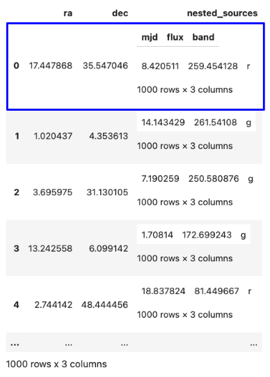
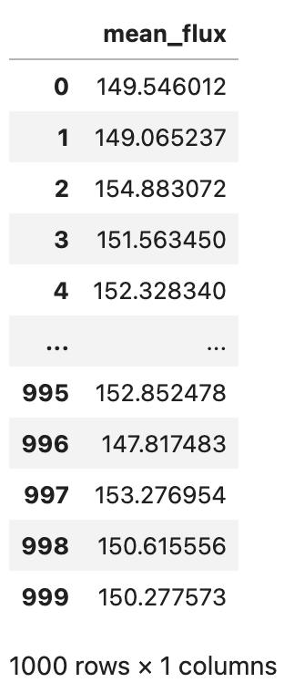

# nested-pandas

[](https://lincc-ppt.readthedocs.io/en/latest/)

[](https://pypi.org/project/nested-pandas/)
[](https://anaconda.org/conda-forge/nested-pandas)

[](https://github.com/lincc-frameworks/nested-pandas/actions/workflows/smoke-test.yml)
[](https://codecov.io/gh/lincc-frameworks/nested-pandas)
[](https://nested-pandas.readthedocs.io/)
[](https://lincc-frameworks.github.io/nested-pandas/)

An extension of pandas for efficient representation of nested
associated datasets.

Nested-Pandas extends the [pandas](https://pandas.pydata.org/) package with 
tooling and support for nested dataframes packed into values of top-level 
dataframe columns. [Pyarrow](https://arrow.apache.org/docs/python/index.html) 
is used internally to aid in scalability and performance.

Nested-Pandas allows data like this:

<p align="center">
    
</p>

To instead be represented like this:

<p align="center">
    
</p>

Where the nested data is represented as nested dataframes:

```python
   # Each row of "object_nf" now has it's own sub-dataframe of matched rows from "source_df"
   object_nf.loc[0]["nested_sources"]
```

<p align="center">
    
</p>

Allowing powerful and straightforward operations, like:

```python
   # Compute the mean flux for each row of "object_nf"
   import numpy as np
   object_nf.reduce(np.mean, "nested_sources.flux")
```

<p align="center">
    
</p>

Nested-Pandas is motivated by time-domain astronomy use cases, where we see
typically two levels of information, information about astronomical objects and
then an associated set of `N` measurements of those objects. Nested-Pandas offers
a performant and memory-efficient package for working with these types of datasets. 

Core advantages being:
* hierarchical column access
* efficient packing of nested information into inputs to custom user functions
* avoiding costly groupby operations


This is a LINCC Frameworks project - find more information about LINCC Frameworks [here](https://lsstdiscoveryalliance.org/programs/lincc-frameworks/).


## Acknowledgements

This project is supported by Schmidt Sciences.
