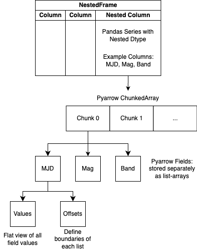

Internal Representation of Nested Data
======================================
"Dataframes within Dataframes" is a useful hueristic for understanding the 
API/workings of a NestedFrame. However, the actual storage representation 
leverages pyarrow and materializes the nested dataframes as a view of the 
data. The following diagram details the actual storage representation of 
nested-pandas:

The advantage of this approach is that each sub-column ("field" in pyarrow) is
stored in a flat array, with an offset array used to slice the data into the
respective sub-dataframes. This allows for efficient transformations to other
data representations (dataframes, list-arrays, flat arrays, etc.) which are
used internally to minimize overhead of operations involving nested data.

Nested Serialization to Parquet
-------------------------------
The internal design of nested columns has valid pyarrow struct-list objects
underneath. This allows for direct serialization of nested columns to the
parquet format. nested-pandas will automatically write nested columns to
parquet format as valid pyarrow dtypes, which allows for them to be read
by other parquet readers that support complex types. Additionally, nested-pandas
will attempt to cast pyarrow struct-list columns to nested columns directly
when reading from parquet.

Multi-level Nesting Support
---------------------------
At this time, nested-pandas only supports a single level of nesting. Though we
intend to support multiple levels of nesting in the future, and would be
additionally motivated by community use cases that would benefit from this.