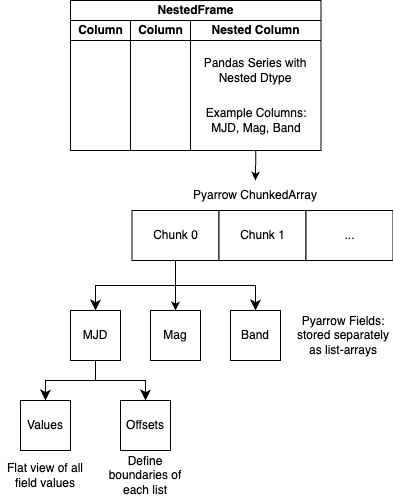

Internal Representation of Nested Data
======================================
"Dataframes within Dataframes" is a useful hueristic for understanding the 
API/workings of a NestedFrame. However, the actual storage representation 
leverages `pyarrow` and materializes the nested dataframes as a view of the 
data. The following diagram details the actual storage representation of 
`nested-pandas`:

