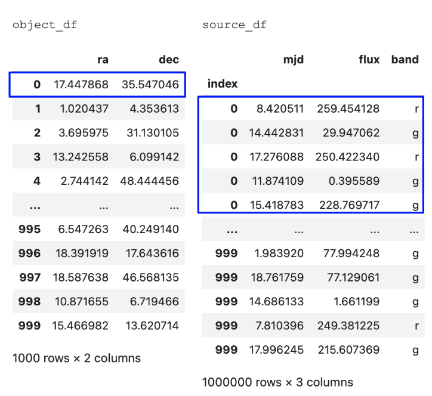
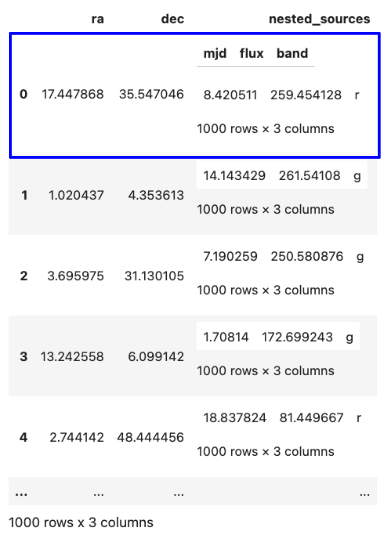
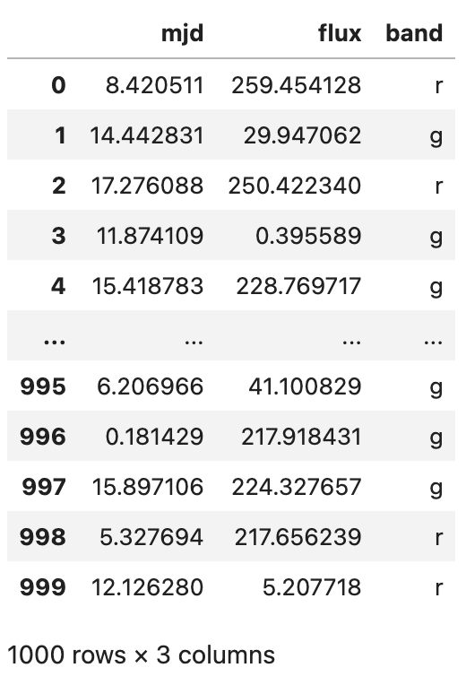
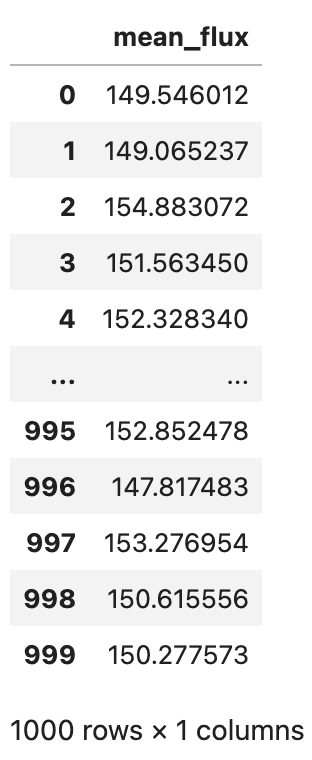

.. nested_pandas documentation main file.
   You can adapt this file completely to your liking, but it should at least
   contain the root `toctree` directive.

Nested-Pandas
=============

An extension of pandas for efficient representation of nested
associated datasets.

Nested-Pandas extends the `pandas <https://pandas.pydata.org/>`_ package with 
tooling and support for nested dataframes packed into values of top-level 
dataframe columns. `Pyarrow <https://arrow.apache.org/docs/python/index.html>`_ 
is used internally to aid in scalability and performance.

Nested-Pandas allows data like this:

To instead be represented like this:

Where the nested data is represented as nested dataframes:

.. code-block:: python

   # Each row of "object_nf" now has it's own sub-dataframe of matched rows from "source_df"
   object_nf.loc[0]["nested_sources"]

Allowing powerful and straightforward operations, like:

.. code-block:: python

   # Compute the mean flux for each row of "object_nf"
   import numpy as np
   object_nf.reduce(np.mean, "nested_sources.flux")

Nested-Pandas is motivated by time-domain astronomy use cases, where we see
typically two levels of information, information about astronomical objects and
then an associated set of `N` measurements of those objects. Nested-Pandas offers
a performant and memory-efficient package for working with these types of datasets. 

Core advantages being:

* hierarchical column access
* efficient packing of nested information into inputs to custom user functions
* avoiding costly groupby operations

How to Use This Guide
=====================

Begin with the :doc:`Getting Started <gettingstarted/installation>`
guide to learn the basics of installation and walkthrough a simple example of 
using nested-pandas.

The :doc:`Tutorials <tutorials>`
section showcases the fundamental features of nested-pandas.

API-level information about nested-pandas is viewable in the 
:doc:`API Reference <reference>`
section.

Learn more about contributing to this repository in our :doc:`Contribution Guide <gettingstarted/contributing>`.

.. toctree::
   :hidden:

   Home page <self>
   Getting Started <gettingstarted>
   Tutorials <tutorials>
   API Reference <reference>
